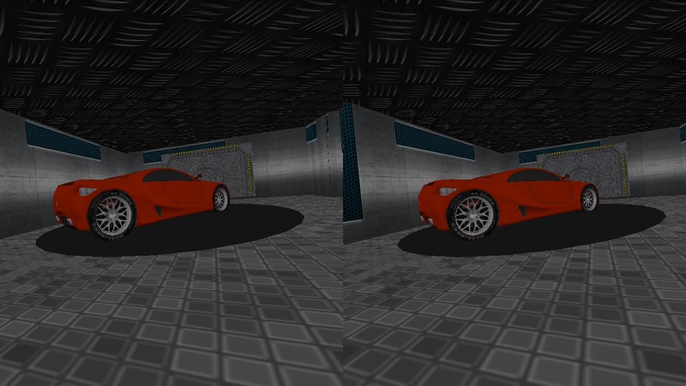
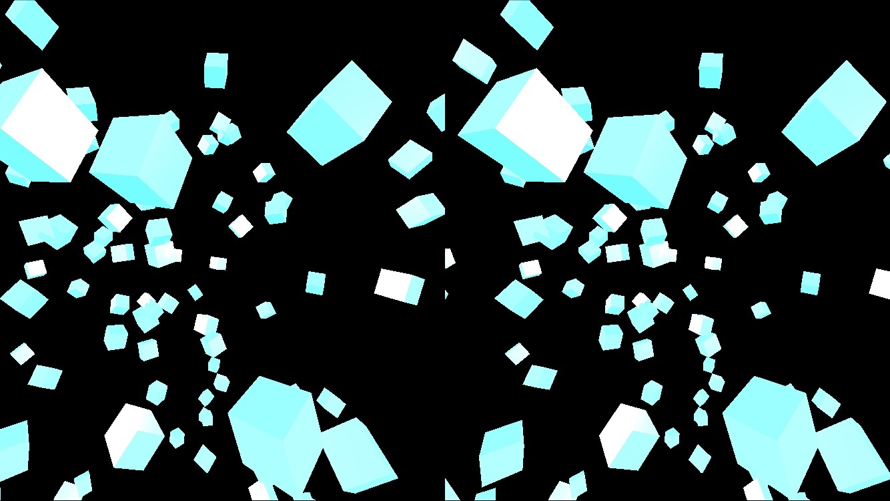

# Intergalactic VR

###### A virtual reality music experience created with Three.js and Web Audio

Three.js library allowed for rendering of 3D world and camera track movement. Taps into device's gyroscope to orient user in the environment. Creation and transformation of cubes are dynamically rendered based on the frequency of the sound using Web Audio API.

Designed for iOS/Android and Google Cardboard

---

### Screenshots:

---

### Developer Notes

Let's put some code discussion here

